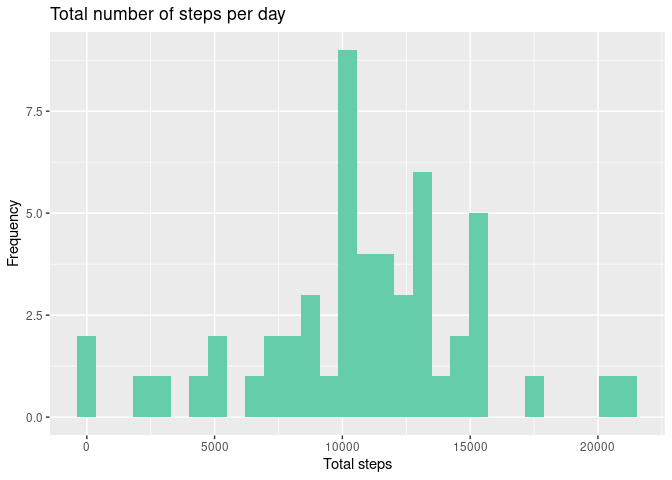

## Introduccion

This analysis uses data from a personal activity tracking device. This device collects data at 5-minute intervals throughout the day. The data consists of two months of data from an anonymous anonymous individual collected during the months of October and November 2012 and includes the number of steps taken at 5-minute intervals each day.

### Data
The variables included in this dataset are:

* **steps**: Number of steps taking in a 5-minute interval (missing
    values are coded as `NA`)

* **date**: The date on which the measurement was taken in YYYY-MM-DD
    format

* **interval**: Identifier for the 5-minute interval in which
    measurement was taken


## Loading and preprocessing the data

First we load the necessary packages, in this case data.table. Verify that the data is in the working directory.

```r
# load packages
library(data.table)
unzip("activity.zip")
activity <- fread("activity.csv", sep = ",", 
                  col.names = c("steps", "date", "interval"))
str(activity)
```

```
## Classes 'data.table' and 'data.frame':	17568 obs. of  3 variables:
##  $ steps   : int  NA NA NA NA NA NA NA NA NA NA ...
##  $ date    : IDate, format: "2012-10-01" "2012-10-01" ...
##  $ interval: int  0 5 10 15 20 25 30 35 40 45 ...
##  - attr(*, ".internal.selfref")=<externalptr>
```


## What is mean total number of steps taken per day?
For this part, ignore the missing values in the dataset.

#### 1. Histogram of the total number of steps taken each day

```r
#load packages
library(dplyr)
```

```r
#calculate total number of steps per day
data <- activity %>% group_by(date) %>% summarize(total_steps = sum(steps, na.rm = FALSE))
head(data)
```

```
## # A tibble: 6 × 2
##   date       total_steps
##   <date>           <int>
## 1 2012-10-01          NA
## 2 2012-10-02         126
## 3 2012-10-03       11352
## 4 2012-10-04       12116
## 5 2012-10-05       13294
## 6 2012-10-06       15420
```


```r
library(ggplot2)

#histogram
ggplot(data = data, aes(x = total_steps)) +
   geom_histogram(fill = "aquamarine3") + 
    labs(title = "Total number of steps per day", x = "Total steps", y = "Frequency")
```

```
## `stat_bin()` using `bins = 30`. Pick better value with `binwidth`.
```

```
## Warning: Removed 8 rows containing non-finite values (stat_bin).
```

<!-- -->


#### 2. **Mean** and **median** total number of steps taken per day


```r
mean_media <- summary(data$total_steps)
```

The **mean** total number of steps taken per day in $10766$ and **median** is $10765$.


## What is the average daily activity pattern?

#### 1. Average number of steps in each interval per day


```r
ave_steps_interval <- activity %>% select(date, interval, steps) %>% 
    group_by(interval) %>% summarize(ave_steps = mean(steps, na.rm = TRUE))
head(ave_steps_interval)    
```

```
## # A tibble: 6 × 2
##   interval ave_steps
##      <int>     <dbl>
## 1        0    1.72  
## 2        5    0.340 
## 3       10    0.132 
## 4       15    0.151 
## 5       20    0.0755
## 6       25    2.09
```

#### Plot of average steps for interval

Make a time series plot (i.e. `type = "l"`) of the 5-minute interval (x-axis) and the average number of steps taken, averaged across all days (y-axis)


```r
ggplot(data = ave_steps_interval, aes(interval, ave_steps)) +
    geom_line(color = "red") +
    labs(title = "Average steps per interval", x = "Interval", y ="Average steps")
```

<!-- -->

#### Maximum number of steps in an interval

Which 5-minute interval, on average across all the days in the dataset, contains the maximum number of steps?


```r
max_ave_steps <- filter(ave_steps_interval, ave_steps == max(ave_steps))
max_ave_steps
```

```
## # A tibble: 1 × 2
##   interval ave_steps
##      <int>     <dbl>
## 1      835      206.
```
The maximum average number of steps (with a value $206$) occurs in the interval


## Imputing missing values


## Are there differences in activity patterns between weekdays and weekends?


### Session info

```r
sessionInfo()
```

```
## R version 4.1.2 (2021-11-01)
## Platform: x86_64-pc-linux-gnu (64-bit)
## Running under: Ubuntu 21.04
## 
## Matrix products: default
## BLAS:   /usr/lib/x86_64-linux-gnu/openblas-pthread/libblas.so.3
## LAPACK: /usr/lib/x86_64-linux-gnu/openblas-pthread/libopenblasp-r0.3.13.so
## 
## locale:
##  [1] LC_CTYPE=es_UY.UTF-8       LC_NUMERIC=C              
##  [3] LC_TIME=es_UY.UTF-8        LC_COLLATE=es_UY.UTF-8    
##  [5] LC_MONETARY=es_UY.UTF-8    LC_MESSAGES=es_UY.UTF-8   
##  [7] LC_PAPER=es_UY.UTF-8       LC_NAME=C                 
##  [9] LC_ADDRESS=C               LC_TELEPHONE=C            
## [11] LC_MEASUREMENT=es_UY.UTF-8 LC_IDENTIFICATION=C       
## 
## attached base packages:
## [1] stats     graphics  grDevices utils     datasets  methods   base     
## 
## other attached packages:
## [1] ggplot2_3.3.6     dplyr_1.0.9       data.table_1.14.2
## 
## loaded via a namespace (and not attached):
##  [1] highr_0.9        pillar_1.7.0     bslib_0.3.1      compiler_4.1.2  
##  [5] jquerylib_0.1.4  tools_4.1.2      digest_0.6.29    jsonlite_1.8.0  
##  [9] evaluate_0.15    lifecycle_1.0.1  tibble_3.1.7     gtable_0.3.0    
## [13] pkgconfig_2.0.3  rlang_1.0.2      cli_3.3.0        DBI_1.1.2       
## [17] rstudioapi_0.13  yaml_2.3.5       xfun_0.31        fastmap_1.1.0   
## [21] withr_2.5.0      stringr_1.4.0    knitr_1.39       generics_0.1.2  
## [25] vctrs_0.4.1      sass_0.4.1       grid_4.1.2       tidyselect_1.1.2
## [29] glue_1.6.2       R6_2.5.1         fansi_1.0.3      rmarkdown_2.14  
## [33] farver_2.1.0     purrr_0.3.4      magrittr_2.0.3   scales_1.2.0    
## [37] ellipsis_0.3.2   htmltools_0.5.2  assertthat_0.2.1 colorspace_2.0-3
## [41] labeling_0.4.2   utf8_1.2.2       stringi_1.7.6    munsell_0.5.0   
## [45] crayon_1.5.1
```


