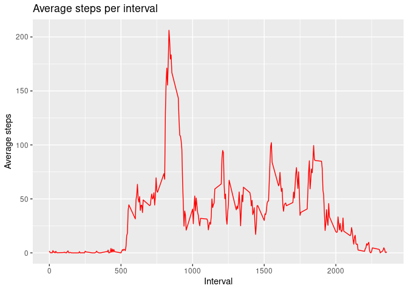

## Introduction

This analysis uses data from a personal activity tracking device. This device collects data at 5-minute intervals throughout the day. The data consists of two months of data from an anonymous anonymous individual collected during the months of October and November 2012 and includes the number of steps taken at 5-minute intervals each day.

### Data
The variables included in this dataset are:

* **steps**: Number of steps taking in a 5-minute interval (missing
    values are coded as `NA`)

* **date**: The date on which the measurement was taken in YYYY-MM-DD
    format

* **interval**: Identifier for the 5-minute interval in which
    measurement was taken


## Loading and preprocessing the data

First we load the necessary packages, in this case data.table. Verify that the data is in the working directory.

```r
# load packages
library(data.table)
unzip("activity.zip")
activity <- fread("activity.csv", sep = ",", 
                  col.names = c("steps", "date", "interval"))
str(activity)
```

```
## Classes 'data.table' and 'data.frame':	17568 obs. of  3 variables:
##  $ steps   : int  NA NA NA NA NA NA NA NA NA NA ...
##  $ date    : IDate, format: "2012-10-01" "2012-10-01" ...
##  $ interval: int  0 5 10 15 20 25 30 35 40 45 ...
##  - attr(*, ".internal.selfref")=<externalptr>
```


## What is mean total number of steps taken per day?
For this part, ignore the missing values in the dataset.

#### 1. Histogram of the total number of steps taken each day

```r
#load packages
library(dplyr)
```

```r
#calculate total number of steps per day
steps_day <- activity %>% group_by(date) %>% summarize(total_steps = sum(steps, na.rm = FALSE))
head(steps_day)
```

```
## # A tibble: 6 × 2
##   date       total_steps
##   <date>           <int>
## 1 2012-10-01          NA
## 2 2012-10-02         126
## 3 2012-10-03       11352
## 4 2012-10-04       12116
## 5 2012-10-05       13294
## 6 2012-10-06       15420
```


```r
library(ggplot2)

#histogram
ggplot(data = steps_day, aes(x = total_steps)) +
   geom_histogram(fill = "aquamarine3") + 
    labs(title = "Total number of steps per day", x = "Total steps", y = "Frequency")
```

```
## `stat_bin()` using `bins = 30`. Pick better value with `binwidth`.
```

```
## Warning: Removed 8 rows containing non-finite values (stat_bin).
```

<!-- -->


#### 2. **Mean** and **median** total number of steps taken per day


```r
mean_media <- summary(steps_day$total_steps)
```

The **mean** total number of steps taken per day in $10766$ and **median** is $10765$.


## What is the average daily activity pattern?

#### 1. Average number of steps in each interval per day


```r
ave_steps_interval <- activity %>% select(date, interval, steps) %>% 
    group_by(interval) %>% summarize(ave_steps = mean(steps, na.rm = TRUE))
head(ave_steps_interval)    
```

```
## # A tibble: 6 × 2
##   interval ave_steps
##      <int>     <dbl>
## 1        0    1.72  
## 2        5    0.340 
## 3       10    0.132 
## 4       15    0.151 
## 5       20    0.0755
## 6       25    2.09
```

#### 2. Plot of average steps for interval

Make a time series plot (i.e. `type = "l"`) of the 5-minute interval (x-axis) and the average number of steps taken, averaged across all days (y-axis)


```r
ggplot(data = ave_steps_interval, aes(interval, ave_steps)) +
    geom_line(color = "red") +
    labs(title = "Average steps per interval", x = "Interval", y ="Average steps")
```

<!-- -->

#### 3. Maximum number of steps in an interval

Which 5-minute interval, on average across all the days in the dataset, contains the maximum number of steps?


```r
max_ave_steps <- filter(ave_steps_interval, ave_steps == max(ave_steps))
max_ave_steps
```

```
## # A tibble: 1 × 2
##   interval ave_steps
##      <int>     <dbl>
## 1      835      206.
```
The maximum average number of steps (206 steps) occurs in the interval 835.


## Imputing missing values

#### 1. Number of NA's in the dataset


```r
data_Na <- activity %>% filter(is.na(steps) == TRUE)
```

The total number of NA's in original dataset is 2304.

#### 2. Filling missing values and create a new dataset

The strategy used to fill the NAs was to consider the average number of steps per 5-minute interval.


```r
new_data <- activity %>%  group_by(interval) %>% 
    mutate(steps = ifelse(is.na(steps), mean(steps, na.rm=TRUE), steps))
```

Create a new dataset that is equal to the original dataset but with the missing data filled in.


```r
fwrite(x = new_data, file = "tidyData.csv", quote = FALSE)
head(new_data)
```

```
## # A tibble: 6 × 3
## # Groups:   interval [6]
##    steps date       interval
##    <dbl> <date>        <int>
## 1 1.72   2012-10-01        0
## 2 0.340  2012-10-01        5
## 3 0.132  2012-10-01       10
## 4 0.151  2012-10-01       15
## 5 0.0755 2012-10-01       20
## 6 2.09   2012-10-01       25
```


#### 3. Histogram  of the total number of steps taken each day

Make a histogram of the total number of steps taken each day and Calculate and report the **mean** and **median** total number of steps taken per day. Do these values differ from the estimates from the first part of the assignment? What is the impact of imputing missing data on the estimates of the total daily number of steps?


```r
#calculate total number of steps per day without NA
steps_day2 <- new_data %>% group_by(date) %>% summarize(total_steps = sum(steps, na.rm = FALSE))

#histogram
ggplot(data = steps_day2, aes(x = total_steps)) +
   geom_histogram(fill = "aquamarine4") + 
    labs(title = "Total number of steps per day (whithout NA values)", x = "Total steps", y = "Frequency")
```

```
## `stat_bin()` using `bins = 30`. Pick better value with `binwidth`.
```

<!-- -->


```r
mean_media2 <- summary(steps_day2$total_steps)
```
The **mean** total number of steps taken per day in $10766$ and **median** is $10766$. Comparing the results obtained with the values obtained from the data with NA we see that there is no significant difference; including values in the NA with the selected strategy made the mean and median acquire the same value. 


```r
rbind(mean_media, mean_media2)
```

```
## Warning in rbind(mean_media, mean_media2): number of columns of result is not a
## multiple of vector length (arg 2)
```

```
##             Min. 1st Qu.   Median     Mean 3rd Qu.  Max. NA's
## mean_media    41    8841 10765.00 10766.19   13294 21194    8
## mean_media2   41    9819 10766.19 10766.19   12811 21194   41
```
We can compare the two histograms to see the difference


```r
library(patchwork)

p1 <- ggplot(data = steps_day, aes(x = total_steps)) +
   geom_histogram(fill = "aquamarine3") + 
    labs(title = "Total number of steps per day", x = "Total steps", y = "Frequency")

p2 <- ggplot(data = steps_day2, aes(x = total_steps)) +
   geom_histogram(fill = "aquamarine4") + 
    labs(title = "Total number of steps per day (whithout NA values)", x = "Total steps", y = "Frequency")

p1+p2
```

```
## `stat_bin()` using `bins = 30`. Pick better value with `binwidth`.
```

```
## Warning: Removed 8 rows containing non-finite values (stat_bin).
```

```
## `stat_bin()` using `bins = 30`. Pick better value with `binwidth`.
```

<!-- -->


## Are there differences in activity patterns between weekdays and weekends?

#### 1. Separating between weekend and weekdays
Create a new factor variable in the dataset with two levels -- "weekday" and "weekend" indicating whether a given date is a weekday or weekend day.


```r
new_data <- new_data %>% mutate(week_day = weekdays(date)) %>% 
    mutate(factor_week = as.factor(if_else(week_day %in% c("sábado", "domingo"), "weekend", "weekday")))
head(new_data)
```

```
## # A tibble: 6 × 5
## # Groups:   interval [6]
##    steps date       interval week_day factor_week
##    <dbl> <date>        <int> <chr>    <fct>      
## 1 1.72   2012-10-01        0 lunes    weekday    
## 2 0.340  2012-10-01        5 lunes    weekday    
## 3 0.132  2012-10-01       10 lunes    weekday    
## 4 0.151  2012-10-01       15 lunes    weekday    
## 5 0.0755 2012-10-01       20 lunes    weekday    
## 6 2.09   2012-10-01       25 lunes    weekday
```
#### 2. Plot average number of steps per interval in weekend or weekday

Make a panel plot containing a time series plot (i.e. `type = "l"`) of the 5-minute interval (x-axis) and the average number of steps taken, averaged across all weekday days or weekend days (y-axis).


```r
#calculate average steps in each interval for weekend and weekdy
ave_steps_interval2 <- new_data %>% select(interval, steps, factor_week) %>% 
    group_by(interval, factor_week) %>% summarize(ave_steps = mean(steps, na.rm = TRUE))
```

```
## `summarise()` has grouped output by 'interval'. You can override using the
## `.groups` argument.
```

```r
# panel plot
ggplot(data = ave_steps_interval2, aes(interval, ave_steps, color = factor_week)) +
    facet_grid(factor_week~.) +
    geom_line() +
    theme(legend.position="none") +
    labs(title = "Average steps per interval on weekdays and weekends", x = "Interval", y ="Average steps")
```

<!-- -->


### Session info

```r
sessionInfo()
```

```
## R version 4.1.2 (2021-11-01)
## Platform: x86_64-pc-linux-gnu (64-bit)
## Running under: Ubuntu 21.04
## 
## Matrix products: default
## BLAS:   /usr/lib/x86_64-linux-gnu/openblas-pthread/libblas.so.3
## LAPACK: /usr/lib/x86_64-linux-gnu/openblas-pthread/libopenblasp-r0.3.13.so
## 
## locale:
##  [1] LC_CTYPE=es_UY.UTF-8       LC_NUMERIC=C              
##  [3] LC_TIME=es_UY.UTF-8        LC_COLLATE=es_UY.UTF-8    
##  [5] LC_MONETARY=es_UY.UTF-8    LC_MESSAGES=es_UY.UTF-8   
##  [7] LC_PAPER=es_UY.UTF-8       LC_NAME=C                 
##  [9] LC_ADDRESS=C               LC_TELEPHONE=C            
## [11] LC_MEASUREMENT=es_UY.UTF-8 LC_IDENTIFICATION=C       
## 
## attached base packages:
## [1] stats     graphics  grDevices utils     datasets  methods   base     
## 
## other attached packages:
## [1] patchwork_1.1.1   ggplot2_3.3.6     dplyr_1.0.9       data.table_1.14.2
## 
## loaded via a namespace (and not attached):
##  [1] highr_0.9        pillar_1.7.0     bslib_0.3.1      compiler_4.1.2  
##  [5] jquerylib_0.1.4  tools_4.1.2      digest_0.6.29    jsonlite_1.8.0  
##  [9] evaluate_0.15    lifecycle_1.0.1  tibble_3.1.7     gtable_0.3.0    
## [13] pkgconfig_2.0.3  rlang_1.0.2      cli_3.3.0        DBI_1.1.2       
## [17] rstudioapi_0.13  yaml_2.3.5       xfun_0.31        fastmap_1.1.0   
## [21] withr_2.5.0      stringr_1.4.0    knitr_1.39       generics_0.1.2  
## [25] vctrs_0.4.1      sass_0.4.1       grid_4.1.2       tidyselect_1.1.2
## [29] glue_1.6.2       R6_2.5.1         fansi_1.0.3      rmarkdown_2.14  
## [33] farver_2.1.0     purrr_0.3.4      magrittr_2.0.3   scales_1.2.0    
## [37] ellipsis_0.3.2   htmltools_0.5.2  assertthat_0.2.1 colorspace_2.0-3
## [41] labeling_0.4.2   utf8_1.2.2       stringi_1.7.6    munsell_0.5.0   
## [45] crayon_1.5.1
```


